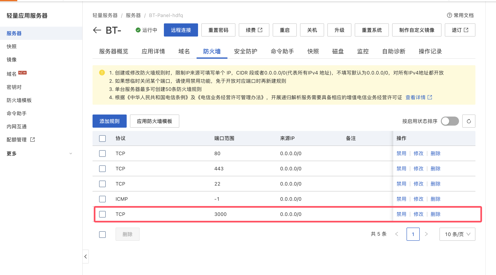
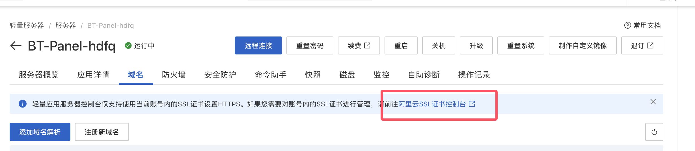
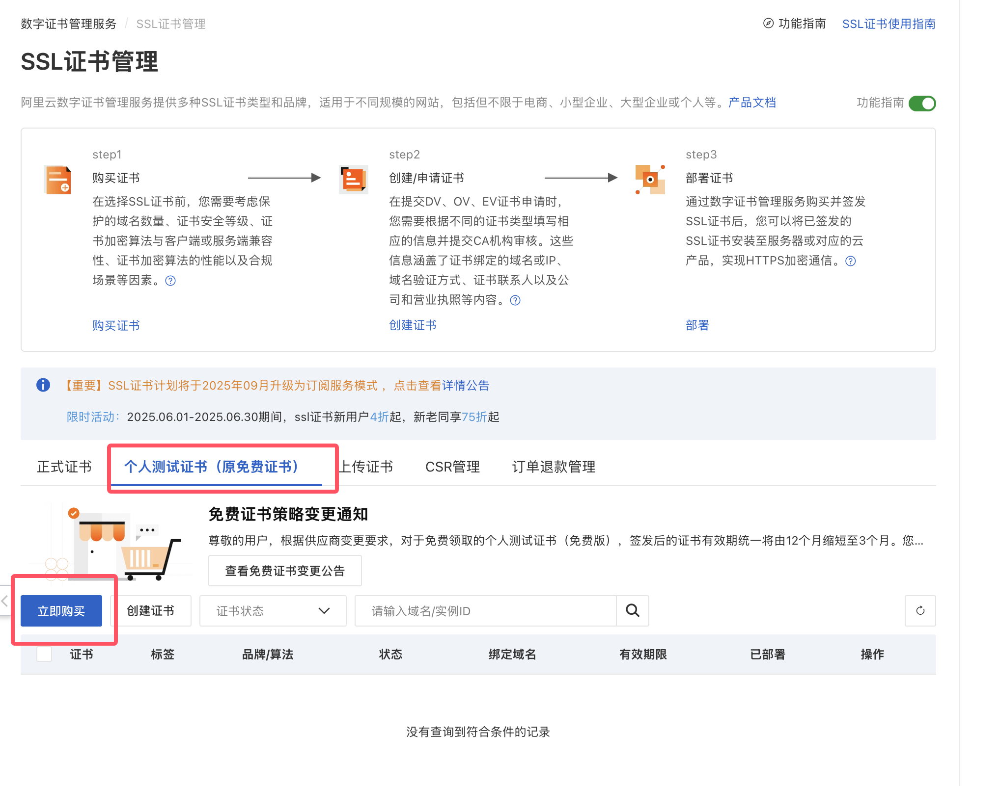
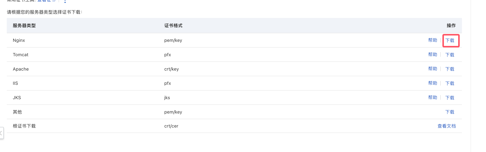

# 如何将 Next.js 项目部署到阿里云服务器

最近我在阿里云服务器上部署了一个 Next.js 项目，记录一下过程，以备后续参考。主要包括以下几个步骤：

- 安装必要的软件
- 克隆仓库
- 使用 Git Action 自动化部署
- Nginx 配置
- 配置 HTTPS

接下来，我将详细介绍每个步骤的具体操作。

## 安装必要的软件

### 安装 Git

```bash
sudo yum install git -y
```

### 安装 Node.js

使用 nvm(Node Version Manager) 来管理 Node 的版本。

- 安装 nvm：

	```bash
	git clone https://gitee.com/mirrors/nvm.git ~/.nvm && cd ~/.nvm && git checkout `git describe --abbrev=0 --tags`
	```

- 配置 nvm 的环境变量：

	```bash
	sudo sh -c 'echo ". ~/.nvm/nvm.sh" >> /etc/profile'
	source /etc/profile
	```
	
- 修改 npm 镜像源为阿里云镜像，以加快 Node.js 下载速度：

	```bash
	export NVM_NODEJS_ORG_MIRROR=https://npmmirror.com/mirrors/node
	```

- 安装所需的 Node.js 版本：

	```bash
	nvm install v22.11.0
	```

- 验证 Node.js 和 npm 是否安装成功：

	```bash
	node -v
	npm -v
	```

### 安装 Nginx

Nginx 是一个高性能的 HTTP 和反向代理服务器。

```bash
sudo yum install nginx -y
```

运行此命令时，我遇到了这个错误：

```bash
Error: Unable to find a match: nginx
```

经过搜索发现，可能有两个原因：
1. EPEL (Extra Packages for Enterprise Linux) 未安装
2. Nginx 在 `/etc/yum.config` 中被排除了

为了解决这个问题，先尝试安装 EPEL：

```bash
sudo dnf install epel-release -y --allowerasing
```

如果仍然报错，可以尝试修改 `/etc/yum.conf` 文件，确保没有将 Nginx 排除在外。可以使用以下命令打开文件：

```bash
sudo vi /etc/yum.conf
```

在文件中查找以 `exclude` 开头这一行，如果有包含 `nginx` 的内容，请将其删除或注释掉。然后保存并退出：

```bash
[main]
gpgcheck=1
installonly_limit=3
clean_requirements_on_remove=True
best=True
skip_if_unavailable=False
# exclude=httpd nginx php mysql mairadb python-psutil python2-psutil
```

再次尝试安装 Nginx，应该可以成功安装。

### 安装 pm2

pm2 是一个 Node.js 的进程管理工具，可以帮助我们管理和监控 Node.js 应用程序。

```bash
sudo npm install -g pm2
```

## 克隆仓库

### 配置 Git 用户信息

在克隆仓库之前，需要配置 Git 的用户信息：

```bash
git config --global user.name "Your Name"
git config --global user.email "your_email@example.com"
```

### 配置 SSH 密钥

- 生成 SSH 密钥对：

	```bash
	ssh-keygen -t rsa -b 4096 -C "your_email@example.com"
	```

	当被提示 `Enter a file in which to save the key (/home/YOU/.ssh/id_ALGORITHM):[Press enter]` 时，直接按 `Enter` 键使用默认路径。

	当被提示 `Enter passphrase (empty for no passphrase)` 时，直接按 `Enter` 键，不设置密码。

- 启动 SSH 代理并添加私钥：

	```bash
	eval "$(ssh-agent -s)"
	ssh-add ~/.ssh/id_rsa
	```

- 将公钥添加到 GitHub 的 [SSH 密钥设置](https://github.com/settings/keys)中。

	```bash
	# 查看公钥
	cat ~/.ssh/id_rsa.pub
	```

### 把仓库克隆到服务器

```bash
cd /path/to/your/project
git clone git@github.com:username/repo.git
cd <your-repo-name>
```

测试项目是否正常运行：

```bash
npm install
npm run build
npm run start
```

可以在控制台看到项目启动成功。但现在访问不了，因为云服务器默认不会开启 3000 端口。先到阿里云服务器的网页后台防火墙设置中，添加规则。如图：



然后就可以使用 `<公网ip>:3000` 访问你的 Next.js 应用了。

## 使用 Git Action 自动化部署

Git Action 是 GitHub 提供的一种持续集成和持续部署（CI/CD）服务，可以帮助我们自动化构建、测试和部署应用程序的过程。通过编写 YAML 配置文件，我们可以定义触发条件、构建环境和执行的步骤。

### 添加 GitHub Secrets

在使用 Git Action 部署应用之前，我们需要将一些敏感信息（如服务器的 SSH 密钥）添加到 GitHub Secrets 中，以便在工作流中安全地使用。

1. 进入你的仓库页面。
2. 点击 "Settings" 标签。
3. 在左侧菜单中，找到 `Secrets and variables > Actions`。
4. 点击 `New repository secret` 按钮，添加以下 Secrets：
   - `SERVER_HOST`：服务器的公网 IP。
   - `SERVER_USERNAME`：服务器的用户名。
   - `SERVER_PASSWORD`：你的服务器的密码。

### 添加 GitHub Actions 工作流

在你的项目根目录下，创建一个 `.github/workflows` 目录，并在其中创建一个名为 `deploy.yml` 的文件。将以下内容添加到 `deploy.yml` 文件中：

```yaml
name: Build and Deploy # 为 GitHub Actions 工作流命名

on:
  push:
    branches:
      - main # 当推送到 main 分支时触发工作流

jobs:
  build-and-deploy:
    runs-on: ubuntu-latest # 使用 Ubuntu 操作系统作为运行环境

    steps:
      - name: Checkout # 步骤1：从仓库检出代码
        uses: actions/checkout@v3
        with:
          persist-credentials: false # 不保留凭据

      - name: Build and Deploy # 步骤2：构建和部署
        uses: appleboy/ssh-action@master # 使用SSH Action插件
        with:
          host: ${{ secrets.SERVER_HOST }} # 从 GitHub Secrets 中获取服务器主机名
          username: ${{ secrets.SERVER_USERNAME }} # 从 GitHub Secrets 中获取服务器用户名
          password: ${{ secrets.SERVER_PASSWORD }} # 从 GitHub Secrets 中获取服务器密码
          script: |
            export NVM_DIR=~/.nvm # 设置 NVM 的安装目录
            source ~/.nvm/nvm.sh # 加载 NVM
            cd /path/to/your/project
            git pull 
            npm install  
            npm run build
            pm2 restart <app_name> --interpreter none -- start  # 使用 PM2 重启应用程序
```

请注意 `script` 中的：

```bash
export NVM_DIR=~/.nvm # 设置 NVM 的安装目录
source ~/.nvm/nvm.sh # 加载 NVM
```

如果不执行以上两行代码，运行后面的 `npm install` 和 `npm run build` 时，会出现 `npm: command not found` 的错误。

因为我们使用 nvm 来管理 Node.js 版本，所以在 GitHub Actions 中需要执行这两行代码，以确保正确加载 nvm 和 Node.js 环境。

到此，GitHub Actions 的工作流就配置完成了。每当我们向 `main` 分支推送代码时，工作流就会自动触发，拉取最新代码并在服务器上执行构建和部署操作。

### 可能会遇到的问题

1. **Git Action 执行的时候出现这个错误：Connect to host github.com port 22: Connection timed out。**

	**解决方法**：
	
	- 进入 `.ssh` 文件夹，新增 `config` 文件，内容如下：

		```bash
		Host github.com
		User git
		Hostname ssh.github.com
		PreferredAuthentications publickey
		IdentityFile ~/.ssh/id_rsa
		Port 443
		
		Host gitlab.com
		Hostname altssh.gitlab.com
		User git
		Port 443
		PreferredAuthentications publickey
		IdentityFile ~/.ssh/id_rsa
		```

	- 保存后，执行 `ssh -T git@github.com` 检查是否能访问。

## Nginx 配置

到目前为止，我们可以通过 `<公网ip>:3000` 访问 Next.js 应用。但通常来说，我们希望通过域名来访问它。

1. 打开 Nginx 配置文件：

```bash
sudo vi /etc/nginx/nginx.conf
```

2. 将默认的 `server` 部分替换为：

```nginx
server {
    listen       80; # 在 IPv4 地址的 80 端口上监听 HTTP 请求
    listen       [::]:80; # 在 IPv6 地址的 80 端口上监听 HTTP 请求。这样可以确保服务器同时支持 IPv4 和 IPv6
    server_name  www.your_domain.com your_domain.com; # 指定该服务器响应的域名

    # 包含默认配置文件.
    include /etc/nginx/default.d/*.conf;

    location / { # 定义了对根路径（/）的请求如何处理
        proxy_pass http://127.0.0.1:3000; # 将匹配到的请求转发到指定的后端服务器
        proxy_http_version 1.1; # 指定与后端服务器之间使用的 HTTP 版本
        proxy_set_header Upgrade $http_upgrade; # 设置 Upgrade 请求头，通常用于 WebSocket 连接的升级
        proxy_set_header Connection 'upgrade'; # 设置 Connection 请求头为 upgrade，也是为了支持 WebSocket
        proxy_set_header Host $host; # 将原始请求的 Host 头部传递给后端服务器，确保后端能够识别请求的主机
        proxy_cache_bypass $http_upgrade; # 如果请求需要升级（如 WebSocket），则绕过缓存
    }
}
```

把 `your_domain.com` 换成你的域名。

3. 检查 Nginx 配置是否正确：

```bash
sudo nginx -t
```

4. 重启 Nginx：

```bash
sudo systemctl restart nginx
```

现在，我们就可以通过域名或者公网 IP 直接访问 Next.js 应用，而不需要指定端口号。

## 配置 HTTPS

### 准备证书

为了安全起见，我们应该为我们的项目配置 HTTPS。这里以使用阿里云的免费证书为例。

1. 在服务器详情，点击「域名」tab，进入阿里云 SSL证书控制台：



2. 点击`个人测试证书 -> 立即购买`：



3. 进入页面后，按需求购买即可。

4. 购买后点击「创建证书」，然后等待审核通过后，下载证书文件。



### 配置证书

1. 将下载的证书文件上传到服务器上，例如上传到 `/etc/nginx/ssl` 目录。

	1). `ssl` 文件夹应该是不存在的，首先到 `/etc/nginx/` 文件夹下创建 `ssl` 文件夹：
	```bash
	mkdir ssl
	```

	2). 使用 `scp` 工具把证书文件`xxx.pem` 和 `xxx.key` 上传：
	```bash
	scp /path/to/local/xxx.pem username@remote_host:/etc/nginx/ssl
	```
	`username` 通常是 `root`，`remote_host` 是公网 IP。

2. 修改 Nginx 配置文件，添加 SSL 配置：

	```bash
	sudo vi /etc/nginx/nginx.conf
	```

在原有 `server` 块的基础上，再多加一个 `server` 块：

```nginx
# 原来文章上面的 server
server {
    listen       80; # 在 IPv4 地址的 80 端口上监听 HTTP 请求
    listen       [::]:80; # 在 IPv6 地址的 80 端口上监听 HTTP 请求。这样可以确保服务器同时支持 IPv4 和 IPv6
    server_name  www.your_domain.com your_domain.com; # 指定该服务器响应的域名

    # 包含默认配置文件.
    include /etc/nginx/default.d/*.conf;

    location / { # 定义了对根路径（/）的请求如何处理
        proxy_pass http://127.0.0.1:3000; # 将匹配到的请求转发到指定的后端服务器
        proxy_http_version 1.1; # 指定与后端服务器之间使用的 HTTP 版本
        proxy_set_header Upgrade $http_upgrade; # 设置 Upgrade 请求头，通常用于 WebSocket 连接的升级
        proxy_set_header Connection 'upgrade'; # 设置 Connection 请求头为 upgrade，也是为了支持 WebSocket
        proxy_set_header Host $host; # 将原始请求的 Host 头部传递给后端服务器，确保后端能够识别请求的主机
        proxy_cache_bypass $http_upgrade; # 如果请求需要升级（如 WebSocket），则绕过缓存
    }
}

# 新增的 server
server {
		listen       443 ssl http2;
		listen       [::]:443 ssl http2;
    server_name  www.your_domain.com your_domain.com; # 指定该服务器响应的域名
		root         /usr/share/nginx/html;

		ssl_certificate "/etc/nginx/xxx.pem";
		ssl_certificate_key "/etc/nginx/xxx.key";
		ssl_session_cache shared:SSL:1m;
		ssl_session_timeout  10m;
		ssl_ciphers PROFILE=SYSTEM;
		ssl_prefer_server_ciphers on;

		# Load configuration files for the default server block.
		include /etc/nginx/default.d/*.conf;

		location / { # 定义了对根路径（/）的请求如何处理
				proxy_pass http://127.0.0.1:3000; # 将匹配到的请求转发到指定的后端服务器
				proxy_http_version 1.1; # 指定与后端服务器之间使用的 HTTP 版本
				proxy_set_header Upgrade $http_upgrade; # 设置 Upgrade 请求头，通常用于 WebSocket 连接的升级
				proxy_set_header Connection 'upgrade'; # 设置 Connection 请求头为 upgrade，也是为了支持 WebSocket
				proxy_set_header Host $host; # 将原始请求的 Host 头部传递给后端服务器，确保后端能够识别请求的主机
				proxy_cache_bypass $http_upgrade; # 如果请求需要升级（如 WebSocket），则绕过缓存
		}
}
```

3. 检查 Nginx 配置是否正确：

```bash
sudo nginx -t
```

4. 重启 Nginx：

```bash
sudo systemctl restart nginx
```

现在，我们就可以通过 HTTPS 访问 Next.js 应用了。