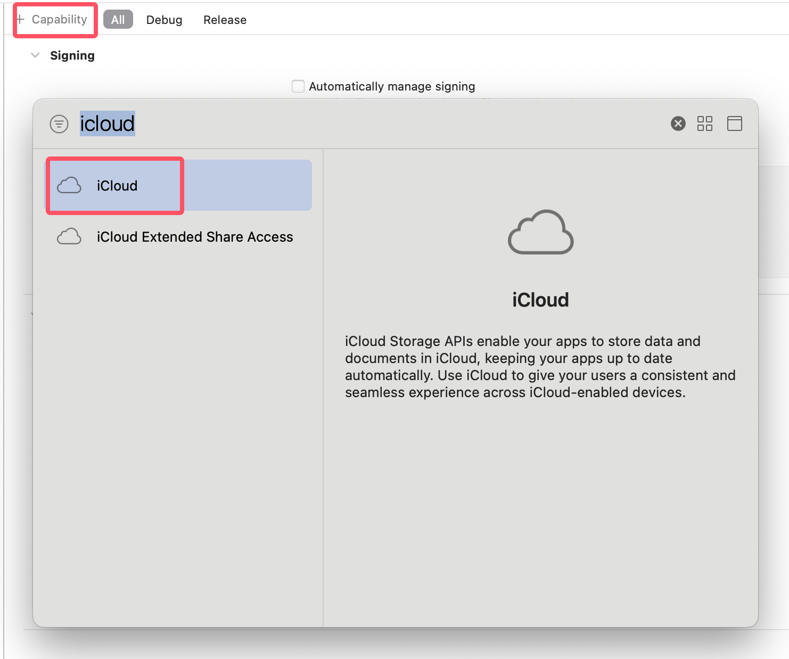
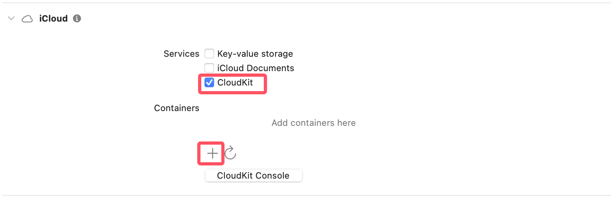
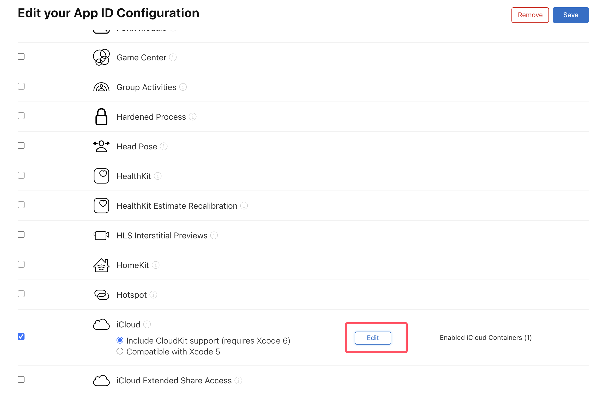

# Integrating Core Data with CloudKit

## Prerequisites

1. Edit your App ID Configuration to make the capabilities enabled: CloudKit(Add and enable container), Push Notifications.

## Add CloudKit Capabilities

1. Add CloudKit capabilities to your Xcode project.

2. Add Background Modes capability to your Xcode project.

3. Enable CloudKit and add container. The container should match your app's bundle identifier.

## Questions

1. Provisioning profile "YourAppName" doesn't support the iCloud.your.bundle.identifier iCloud Container.

