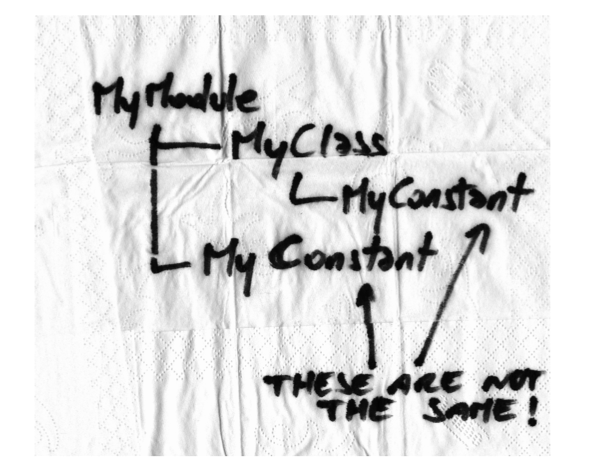
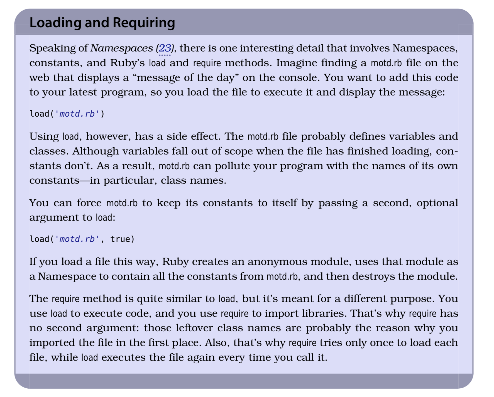
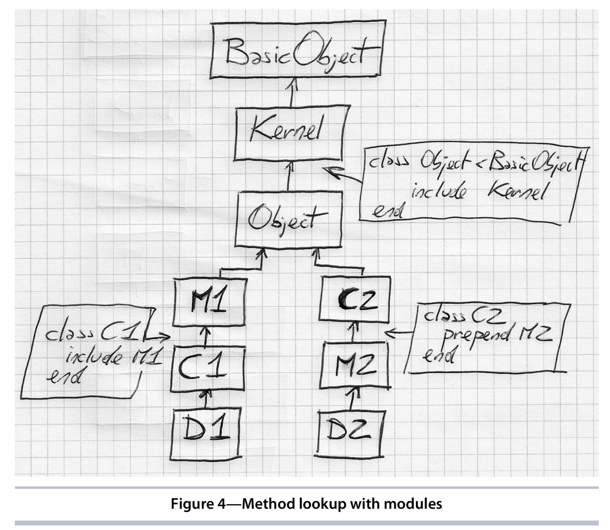
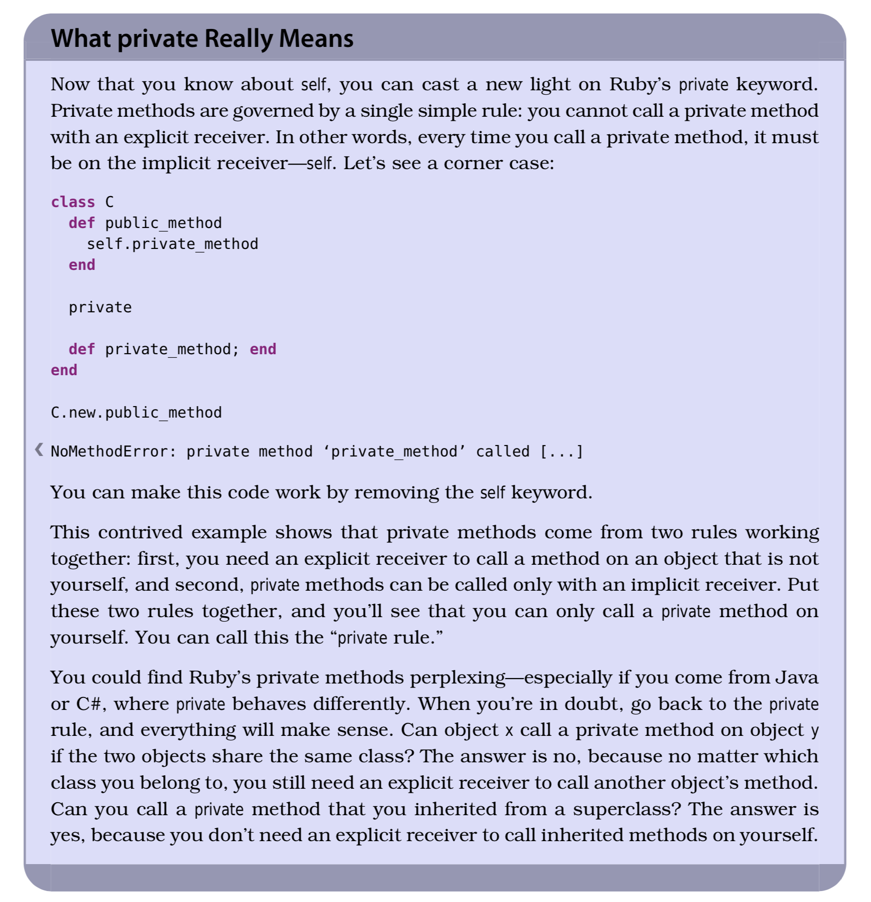

# 02 - The Object Model

## 1. 直接扩展方法

```ruby
class String
  def to_alphanumeric
    gsub(/[^\w\s]/, '') 
	end
end

# 使用 refine 可不全局修改，refine 只在两个地方生效：
# 1）在 refine 所在的 block；
# 2）从使用 using 直到 module 的结束（如果在文件的顶部使用 using，则到文件的末尾）

# refine 的逻辑优先于类中已存在的逻辑，也优先于通过 include 和 prepend 导入进来的代码。
# `methods` 和 `ancestors` 这两个方法会忽略使用 refine 定义的方法

module StringExtensions
  refine String do
    def to_alphanumeric
      gsub(/[^\w\s]/, '')
    end
  end
end
```

## 2. 实例变量存储在对象中，而实例方法存储在类中。


3. 实际上，在 Ruby 中，类与模块非常接近，完全可以用任意一个来代表另外一个。保留着两个概念的主要原因是为了获得代码的清晰性，让代码的意图显得更加明确。如果你希望把自己的代码包含到别的代码中，就应该使用模块；如果你希望某段代码被实例化或者被继承，就应该使用类。

## 4. objects, classes 和 modules 的区别


5. Constants 在程序中是以类似文件系统的树结构存储的；访问路径：`MyModule::MyConstant`

```ruby
module MyMoudle
	MyConstant = 'Outer constant'

	class MyClass
		Myconstant = 'Inner constant'
	end
end
```



## 6. load 和 require的区别



## 7. include 和 prepend 的区别

- include：在原型链中，把被包含的 module 插入到 includer 的上面

```ruby
module M1
	def my_method
		'M1#my_method()'
	end
end

class C
	include M1
end

class D < C
end

D.ancestors   # => [D, C, M1, Object, Kernel, BasicObject]
```

- prepend：在原型链中，把被包含的 module 插入到 includer 的下面

```ruby
class C2
	prepend M2
end

class D2 < C2
end

D2.ancestors    # => [D2, M2, C2, Object, Kernel, BasicObject]
```



- 多个 inclusions：如果原型链中已经存在某个 module，后面再插入同一个 module，Ruby 会忽略后面的插入操作。

```ruby
module M1
end

module M2
	include M1
end

module M3
	prepend M1
	include M2
end

M3.ancestors    # => [M1, M3, M2]
```

## 8. `private`方法只能使用隐式的 receiver 去调用，不能用`self.private_method`.


